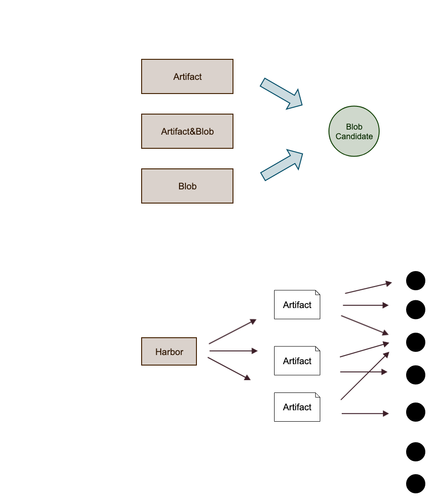
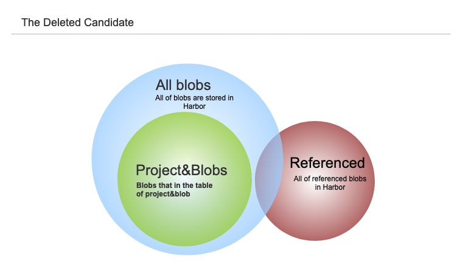
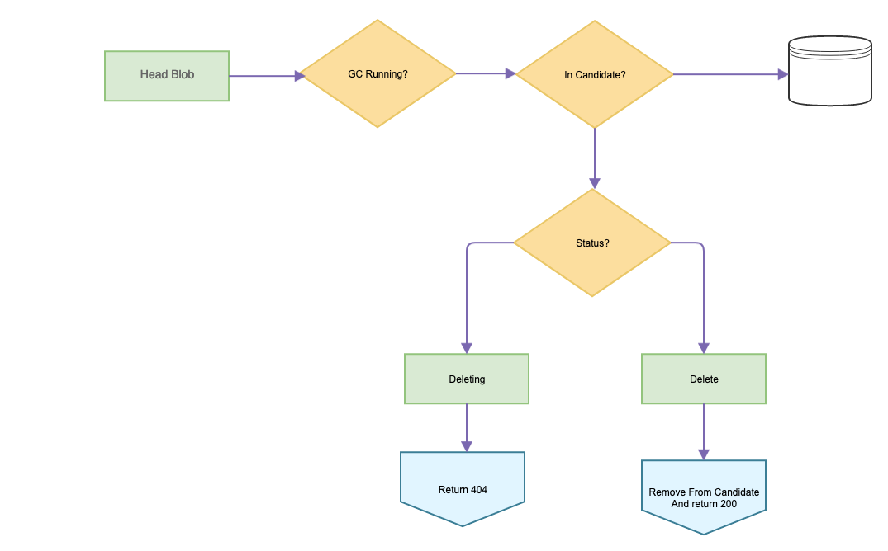
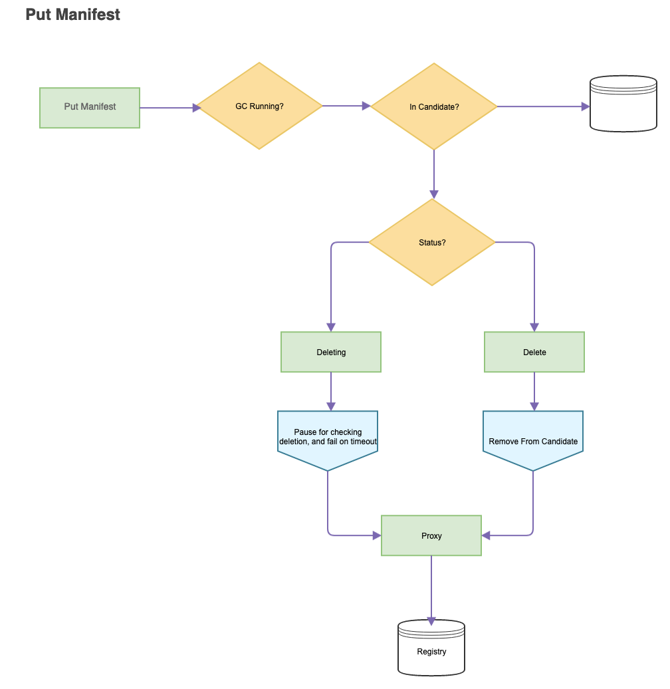
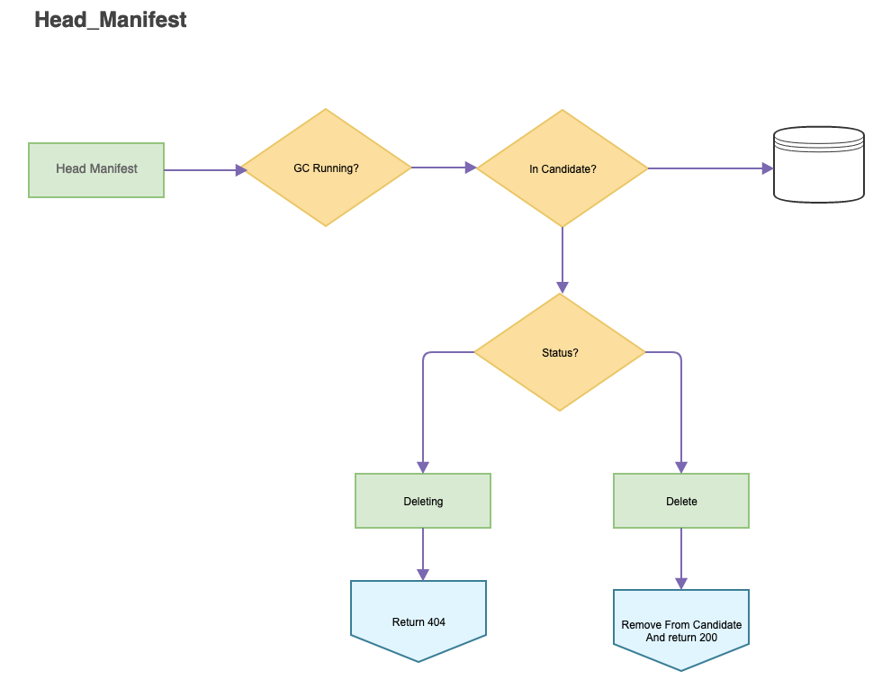
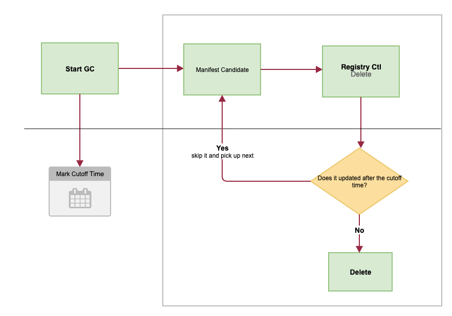
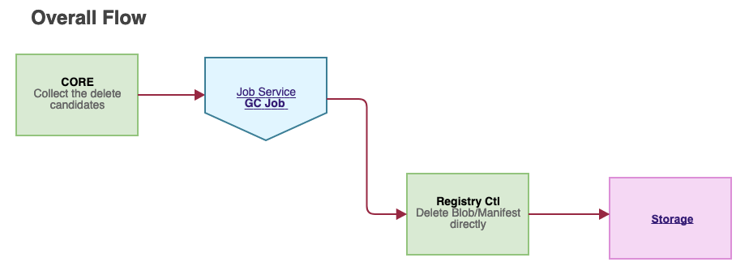

Proposal: Non-Blocking GC

Author: Yan Wang

## Abstract

Garbage Collection is a automatically way to delete unused image layers, then saving the disk usage.

## Motivation

In the current release, Harbor uses online garbage collection, which needs Harbor to run with setting to readonly mode.
During this time, any pushes are prohibited. 
And in some cases, especially on the cloud based backend, the execution time of GC is longer than several hours. 

## Solution

This proposal wants to try to introduce a way to enable non-blocking GC without setting Harbor to readonly. Push is still 
work at the time of GC execute.

### OCI Database

To facilitate non-blocking GC, Harbor builds up a OCI Data Base to track all the uploaded assets,

Before digging into details, let's to explain the OCI artifact components.

The components of a OCI artifact:

* Configuration file

It contains the architecture of the image and other metadata
* Layers

A list of image layers that are unioned which represents the image filesystem
* Manifest

The list of all blobs and configuration file for a artifact

#### OCI Data

Each artifact stored in Harbor is made up of several DB records, like library/hello-world:latest:

* Repository Table

| reposistory_id | name                | project_id | description | pull_count | star_count | creation_time              | update_time                |
|----------------|---------------------|------------|-------------|------------|------------|----------------------------|----------------------------|
| 1              | library/hello-world | 1          |             | 3          | 0          | 2020-03-19 10:57:38.295459 | 2020-03-20 04:00:26.564141 |

* Artifact Table

| id | project_id | repository_name     | digest                                                                  | type  | pull_time                  | push_time                  | repository_id | media_type                                     | manifest_media_type                                  | size | extra_attrs                                                                                    | annotations |
|----|------------|---------------------|-------------------------------------------------------------------------|-------|----------------------------|----------------------------|---------------|------------------------------------------------|------------------------------------------------------|------|------------------------------------------------------------------------------------------------|-------------|
| 1  | 1          | library/hello-world | sha256:92c7f9c92844bbbb5d0a101b22f7c2a7949e40f8ea90c8b3bc396879d95e899a | IMAGE | 2020-03-20 04:00:26.565073 | 2020-03-19 10:57:38.343449 | 1             | application/vnd.docker.container.image.v1+json | application/vnd.docker.distribution.manifest.v2+json | 3011 | {"architecture":"amd64","author":null,"created":"2019-01-01T01:29:27.650294696Z","os":"linux"} | NULL        |

* Tag Table

| id | repository_id | artifact_id | name   | push_time                  | pull_time |
|----|---------------|-------------|--------|----------------------------|-----------|
| 1  | 1             | 1           | latest | 2020-03-19 10:57:38.374554 | NULL      |

* Artifact&Blobs Table

| id 	| digest_af                                                               	| digest_blob                                                             	| creation_time              	|
|----	|-------------------------------------------------------------------------	|-------------------------------------------------------------------------	|----------------------------	|
| 1  	| sha256:92c7f9c92844bbbb5d0a101b22f7c2a7949e40f8ea90c8b3bc396879d95e899a 	| sha256:fce289e99eb9bca977dae136fbe2a82b6b7d4c372474c9235adc1741675f587e 	| 2020-03-19 10:57:38.389146 	|
| 2  	| sha256:92c7f9c92844bbbb5d0a101b22f7c2a7949e40f8ea90c8b3bc396879d95e899a 	| sha256:1b930d010525941c1d56ec53b97bd057a67ae1865eebf042686d2a2d18271ced 	| 2020-03-19 10:57:38.390572 	|
| 3  	| sha256:92c7f9c92844bbbb5d0a101b22f7c2a7949e40f8ea90c8b3bc396879d95e899a 	| sha256:92c7f9c92844bbbb5d0a101b22f7c2a7949e40f8ea90c8b3bc396879d95e899a 	| 2020-03-19 10:57:38.391286 	|

* Blobs Table

| id | digest                                                                  | content_type                                         | size | creation_time              |
|----|-------------------------------------------------------------------------|------------------------------------------------------|------|----------------------------|
| 1  | sha256:1b930d010525941c1d56ec53b97bd057a67ae1865eebf042686d2a2d18271ced | application/vnd.docker.image.rootfs.diff.tar.gzip    | 977  | 2020-03-19 10:57:37.951758 |
| 2  | sha256:fce289e99eb9bca977dae136fbe2a82b6b7d4c372474c9235adc1741675f587e | application/vnd.docker.container.image.v1+json       | 1510 | 2020-03-19 10:57:38.215314 |
| 3  | sha256:92c7f9c92844bbbb5d0a101b22f7c2a7949e40f8ea90c8b3bc396879d95e899a | application/vnd.docker.distribution.manifest.v2+json | 524  | 2020-03-19 10:57:38.385156 |

* Project_Blobs Table

| id | project_id | blob_id | creation_time              |
|----|------------|---------|----------------------------|
| 1  | 1          | 1       | 2020-03-19 10:57:38.384103 |
| 2  | 1          | 2       | 2020-03-19 10:57:38.382954 |
| 3  | 1          | 3       | 2020-03-19 10:57:38.385899 |

For OCI client starts to upload a artifact to finish, the above items are recorded in Harbor DB.

Base on the above data, what we knows:

    Indetifier of each blob/manifest.
    Reference count of each blob/manifest.

## Non-Blocking

As a system admin, you configure Harbor to run a garbage collection job on a fixed schedule. At the scheduled time, Harbor:

    Identifies and marks unused image layers.
    Deletes the marked image layers.

### Mark
Bases on the Harbor DB, we can count each blob/manifest's reference count, and select the reference count 0 as the candidate.



#### Question 1, how to deal with the uploading blobs at the phase of marking.
We do have a table to record the uploading blobs info, that's project & blob.
The delete candidate excludes all of blobs that in the project & blob.

1. candidate set 1 -- all blobs from table blob exclude the items in the table project & blob.
2. candidate set 1 excludes all of referenced blobs (artifact -> artifact & blob -> blob).



### Sweep
The registry controller will grant the capability of deleting blob & manifest.

#### Question 1, how to deal with the uploading blobs at the phase of sweeping.
Docker client will send a head request to ask the existence of the blob, we will intercept that request.

1. if the blob is in deleting status, fail the request with 404. Docker client will continue to put the blob to registry, but at this time,
all of the uploaded data are stored at '_upload' folder.
2. if the blob is in delete status, remove it from the candidate.



#### Question 2, how to deal with the uploading manifest at the phase of sweeping.
Docker client will always send a put request to push manifest(not for Index), we will intercept that request.

1. if the manifest is in deleting status, pause the request and wait for deletion. Fail it when timeout.
2. if the manifest is in delete status, remove it from the candidate.

The put manifest will be eventually passed to proxy, and let registry to deal with it.



#### Question 3, how to deal with the uploading "untagged manifest" of a index at the phase of sweeping.
Different wit push a stand alone artifact, docker client will send a head request before putting a manifest in push a **untagged** manifest in the process of pushing Index,  we will intercept that request.



#### Question 4, what about if client only sends head request, and no put following.
The manifest or blob will only be removed from the deletion candidates, and it can be GCed in the next execution.

### Delete Blob & Manifest
We'd like to enable the registry controller to have the capability to delete blob & manifest via digest by leveraging the distribution code as library.

**DOUBLE GUARANTEE**

We need to introduce the cutoff time, any to be deleted blob & manifest, the update time must not be later than the cutoff time.


#### API

* Delete Blob
```
DELETE /api/registry/blob/{reference}

STATUS       : 202 Accepted
HEADERS      :
   Connection: keep-alive
   Content-Length: 0
   X-Request-Id: 92e7d4be-0291-4c50-92bd-889d71e1ec78
BODY         :

```

* Delete Manifest
```
DELETE /api/registry/{repo_name}/manifests/{reference}

STATUS       : 202 Accepted
HEADERS      :
   Connection: keep-alive
   Content-Length: 0
   X-Request-Id: 92e7d4be-0291-4c50-92bd-889d71e1ec78
BODY         :

```

Draft code PR has been created: https://github.com/goharbor/harbor/pull/10441

### Overall flow
The basic flow is:

* Mark the GC candidates in Harbor Core
* Trigger a GC job and pass the candidates.
* Call registry controller API to delete blob & manifest in GC job.

