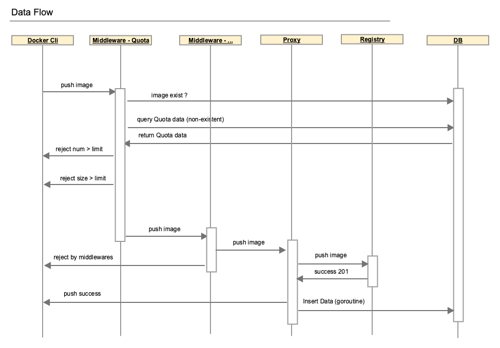
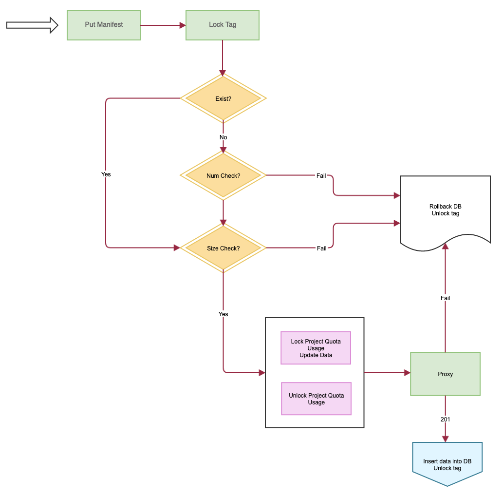
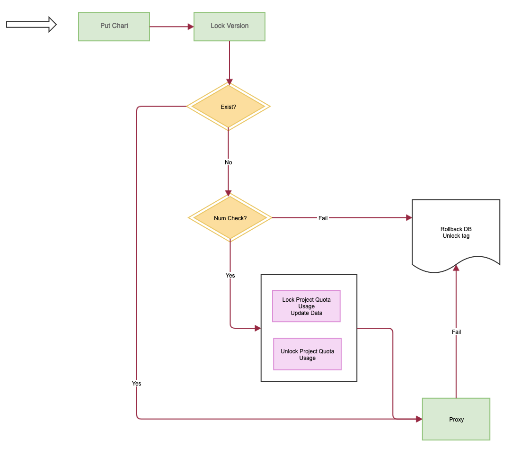
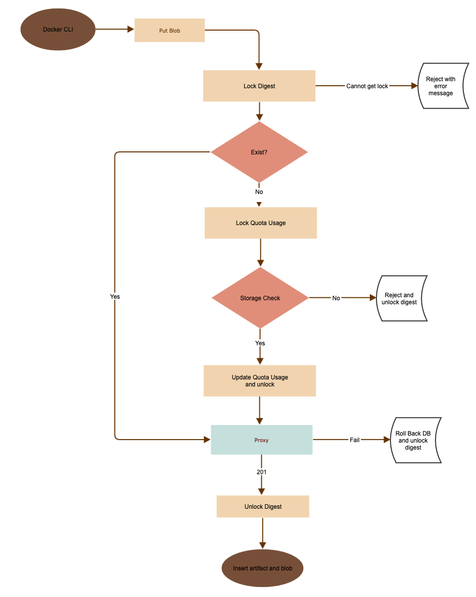
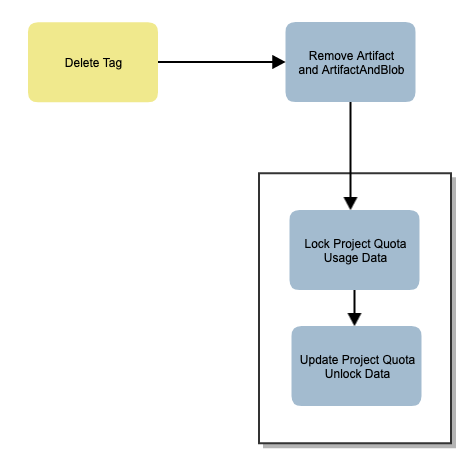
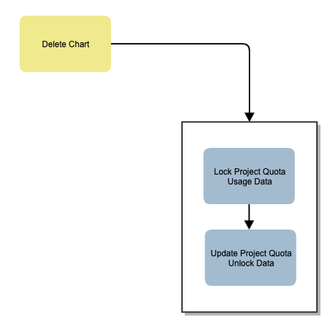

# Project Quota
​
Author: He Weiwei/Yan Wang
​
## Abstract
​
Harbor enforces quotas on resource usage of project, setting a hard limit on how much of a particular artifact count and storage your project can use.
​
​
## Background
​
Currently, users can push docker images, upload helm charts to harbor as many as possible without limit, the result is that one project will use up all resource of the system.
​
## User Stories
​
### Story 1
As a system administrator, I can set the default limit on project artifact count and project storage. But, I cannot control how many projects can Harbor have.
​
### Story 2
As a project administrator, I can only view basic quota information in project quota page, which includes quota usage, limits and errors. 
​
### Story 3 (OUT)
As a project administrator, I can exceed my project limit by sending the request to system admin and wait for response.
​
### Story 4
As a system administrator, I can view all project quota metrics in the quota management page.

### Story 5
As a system administrator, I can set the project quota in the quota management page, either on storage usage or artifact count.

### Story 6
As a system administrator, If I update the default quota, the existing project won't be impacted.

### Story 7
As a system administrator, I can choose the whether to use the default or customized quota on creating a project.

### Story 8
As a user, I cannot see the default quota on creating a project, but I can get it in the quota tab.
​
​
## Proposal
​
We propose the following solutions:
​
1. Add quota management page in administration so that system administrators can set storage and number quota for the project.
2. Add quota information page in the project to display the resources used by the project for project administrators.
3. Modify or hook the docker distribution proxy handler in core component, denied push when new pushed image over the storage and number quota.
4. After image uploaded or deleted, update the storage usage of the project.
5. Modify or hook helm chart upload API, denied upload when new uploaded chart over the storage and number quota.
6. After helm chart uploaded or deleted, update the storage usage of the project.
7. Recalculate the storage usage by project whe upgrade from old version.
​
​
### APIs for quota
 1. List quotas

    ```
    GET /api/quotas/?reference=project
    [
    	{
    		"id": 1,
    		"reference": "project",
    		"reference_id": 1,
    		"hard": {
    			"storage": 1048576,
    			"number": 100
    		}
    	},
    	{
    		"id": 2,
    		"reference": "project",
    		"reference_id": 2,
    		"hard": {
    			"storage": 1048576,
    			"number": 100
    		}
    	}
    ]
    ```
    
 3. Update quota

    ```
    PUT /api/quotas/:id
    {
    	"hard": {
    		"storage": 1048576,
    		"number": 100
    	}
    }
    ```
    
 3. List quota usages

    ```
    GET /api/quota-usages
    [
    	{
    		"id": 1,
    		"reference": "project",
    		"reference_id": 1,
    		"used": {
    			"storage": 48576,
    			"number": 10
    		}
    	},
    	{
    		"id": 2,
    		"reference": "project",
    		"reference_id": 2,
    		"used": {
    			"storage": 1048576,
    			"number": 100
    		}
    	}
    ]
    ```


4. Get project quota

   ```
   GET /api/projects/:pid/quota
   {
     "id": 1,
     "reference": "project",
     "reference_id": 1,
     "hard": {
       "storage": 48576,
       "number": 10
     }
   }
   ```

5. Get project quota usage

   ```
   GET /api/projects/:pid/quota-usage
   {
     "id": 1,
     "reference": "project",
     "reference_id": 1,
     "used": {
       "storage": 48576,
       "number": 10
     }
   }
   ```
   
6. Update default quota

   ```
   PUT /api/configurations
   {
   	"storage_per_project": 48576,
   	"artifact_num_per_project": 100
   }
   ```


### DB scheme

```
CREATE TABLE quota (
 id SERIAL PRIMARY KEY NOT NULL,
 reference VARCHAR(255),
 reference_id VARCHAR(255),
 hard JSONB NOT NUL,
 creation_time timestamp default CURRENT_TIMESTAMP,
 update_time timestamp default CURRENT_TIMESTAMP,
 UNIQUE(reference, reference_id)
)

CREATE TABLE quota_usage (
 id SERIAL PRIMARY KEY NOT NULL,
 reference VARCHAR(255),
 reference_id VARCHAR(255),
 used JSONB NOT NUL,
 creation_time timestamp default CURRENT_TIMESTAMP,
 update_time timestamp default CURRENT_TIMESTAMP,
 UNIQUE(reference, reference_id)
)
```

​​
### Solution on Registry
​
## DB scheme
​
Table -- Blob

```
CREATE TABLE Blob (
 id SERIAL PRIMARY KEY NOT NULL,
 /* 
    digest of config, layer, manifest
 */ 
 digest varchar(255) NOT NULL,
 content_type varchar(255) NOT NULL,
 size int NOT NULL,
 UNIQUE (digest)
);
```

Table -- Artifact

```
CREATE TABLE Artifact (
 id SERIAL PRIMARY KEY NOT NULL,
 project_id int NOT NULL,
 repo varchar(255) NOT NULL,
 tag varchar(255) NOT NULL,
 /* 
    digest of mainfest
 */
 digest varchar(255) NOT NULL,
 kind varchar(255) NOT NULL,
 CONSTRAINT unique_artifact UNIQUE (project_id, repo, tag)
);
```

Table -- ArtifactAndBlob

```
CREATE TABLE ArtifactAndBlob (
 id SERIAL PRIMARY KEY NOT NULL,
 digest_af varchar(255) NOT NULL,
 digest_blob varchar(255) NOT NULL
);
```
​
## Data Flow in Docker registry
​
#The date flow to push a image into Harbor:
​
  
  

#The execution flow of putting a manifest:

  
  
#The execution flow of putting a chart:

  
    
  
#The execution flow to putting a blob:

  
  

#The execution flow of deleting a tag:

  


#The execution flow of deleting a chart:

  
  

### Failure cases 
1, If 1 repo number left and enough storage, Harbor could let only one image pass in multiple push scenario, 
but the failure push has already put blobs into the Harbor and consume the storage.

2, If 100 MB storage quota left, there are 3 push in parallel, 70M, 90M, 20M. In fact, Harbor should let at least one of them pass. 
But, if we count size for blob, all of them may fail.    

3, If hello-world has already in Harbor with 100MB, but the user rebuilds it to a 10MB image and push it again into Harbor.
This will cost 110MB(100MB + 10MB) in Harbor unless to execute garbage collection to delete untagged.   
​
## API
 1. Registry Dump (Sysadmin only)
​
  ```
  POST /api/internal/dumpregistry
  ```
​
The API is for system admin to fix gap between registry and Harbor DB, and the benchmark is the data in docker registry.
We could add the dump API call in the GC job, so that each time run GC, Harbor could have a chance to align data.


## Consideration of performance
1, Docker push.
> Redirect the HEAD request to DB before pushing a blob.
​
2, Registry Client in Core.
> Replace the API by calling DB, like get manifest, layer digest, image size.
​
## Non-Goals
​
# Docker images
Don't split the shared image layer size into pieces, each shared layer will count its size into the total size of a project.
It causes the total usage of a Harbor instance is not reflect true value.
​
## Compatibility
It has to consider how to handle the migration from older version, like v1.7.0.