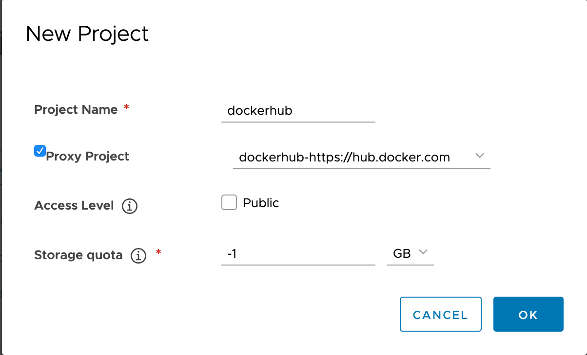
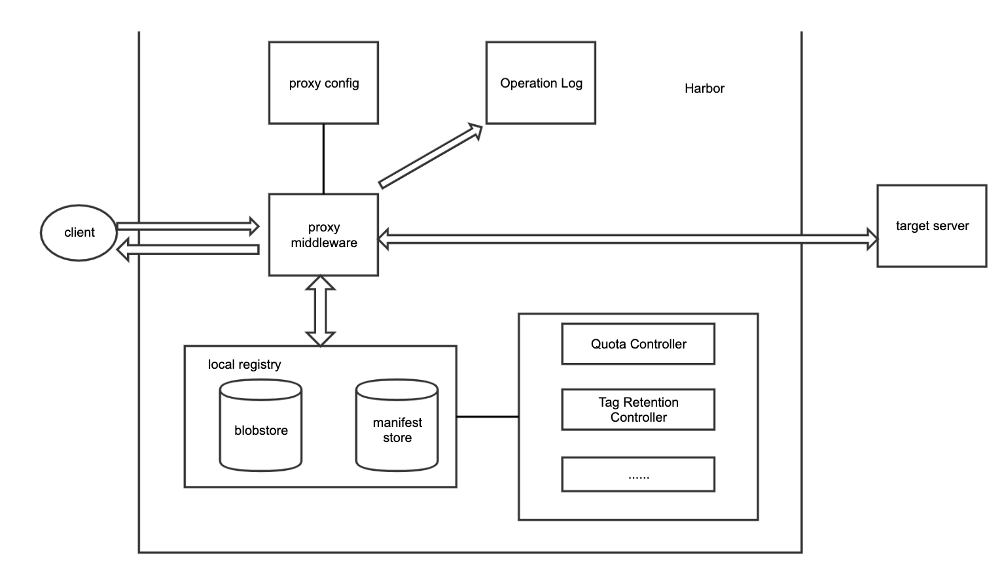
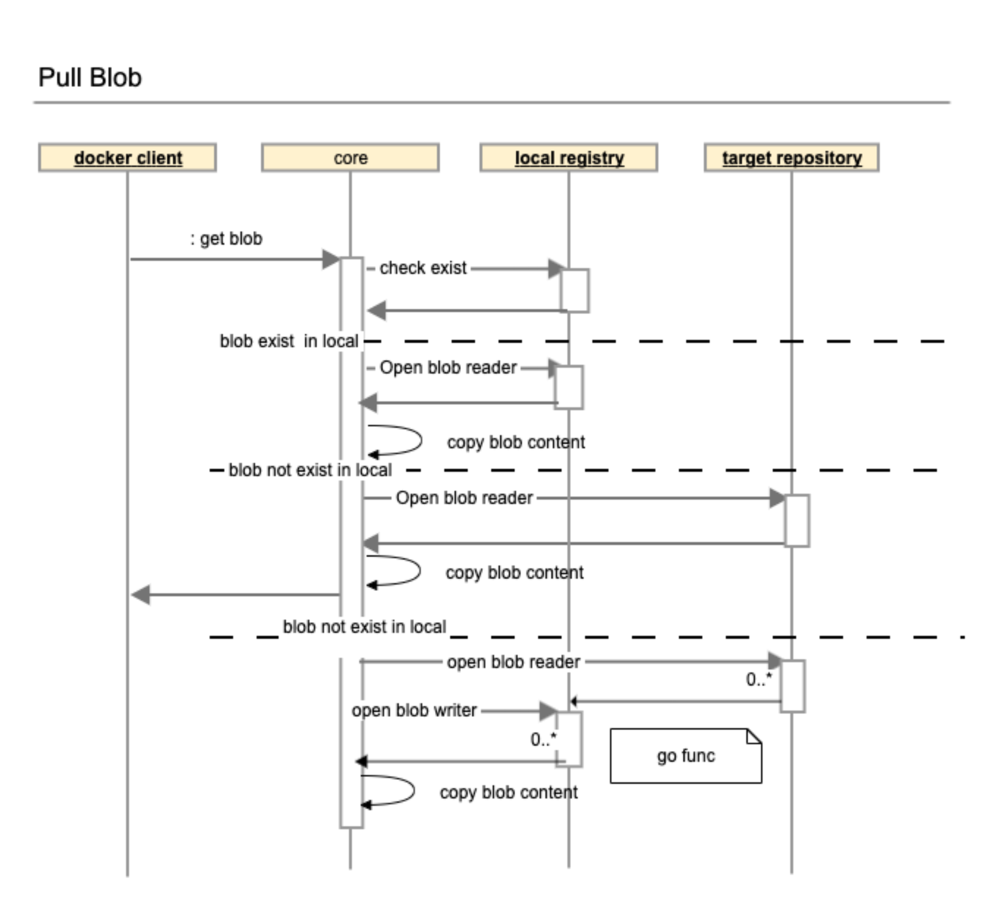

# Proposal:  `Proxy Project`

Author: `stonezdj` `ywk253100`

## Abstract

It proposes an approach to enable Harbor to support proxy remote container registries. 

## Background

For some cases, docker nodes reside in the environment have limit access to internet or no access to the external network to public container registry, or there are too many requests to the public repository that consumes too much bandwidth or it is at the risk of being throttled by the server. There is a need to proxy and cache the request to the target public/private container repository.

## Proposal

We can enhance the current project implementation by adding a proxy project type. When a user create a new project in Harbor, the user can enable the proxy an existing registry.



When proxy project is created, for example, its name is "dockerhub_proxy", the previous command to pull a registry is:
```
docker pull example/hello-world:latest
```
Then the user can pull the image with a updated prefix  `<harbor_servername>/dockerhub_proxy/`

```
docker login <harbor_servername> -u xxxx -p *****
docker pull <harbor_servername>/dockerhub_proxy/example/hello-world:latest
```

When pull request comes to the proxy project, if the image is not cached, it pulls the image from the target server, dockerhub.com, and serves the pull command as if it is a local image. after that, it stores the proxied content to local cache. when same request comes the second time, it checks the latest manifest and serves the blob with local content. if the dockerhub.com is not reachable, it serves the image pull command like a normal Harbor project .

Excessive pulling from hosted registries like dockerhub might result in throttling or IP ban, the pull through proxy feature can help to reduce such risks.

## Goal

Because the proxy project needs to pull images from remote registry, and also have some concurrent limitation on the request, the overall image pull performance degredation must less than 50%.

## Non-Goals

The current implementation is implement proxy function on project level, not a whole Harbor server level, it is different with the docker distribution's solution [pull through proxy cache](https://docs.docker.com/registry/recipes/mirror/)

The proxied artifact only includes container images.

In a proxy project, the retag operation doesn’t bring any side effect to the proxy, it will be kept. the content trust can not be enabled in the proxy project. Other features related to Harbor projects, such as the project membership, label, scanner, tag retention policy, robot account, web hooks, CVE whitelist should work as they were.

## Terminology


* Target server — The original container registry server
* Proxy Server — The Harbor server that receives the request from client and proxy the request to the target server if when required.
* Proxy Cache - The local repository to store the proxied container image. 

## Compatibility

Support to proxy the dockerhub.com or Harbor. 
Support docker client and containerd.

## Implementation

### Basic mechanism

A docker image pull command can be decomposed into serveral HTTP request. For example
```
docker pull library/hello-world:latest
```
The HTTP request to get the content of manifest example/hello-world:latest, this request will send to the repository and the repository intercept the request to the example/hello-world:sha256:xxxxxxxx, and its response with that of get the manifest blob.

```
GET /v2/library/hello-world/manifests/latest
# change to actual request in background
GET /v2/library/hello-world/blobs/sha256:92c7f9c92844bbbb5d0a101b22f7c2a7949e40f8ea90c8b3bc396879d95e899a
```
The client parses the content of the manifest, then get all dependency blobs.
```
GET /v2/library/hello-world/blobs/sha256:1b930d010525941c1d56ec53b97bd057a67ae1865eebf042686d2a2d18271ced
GET /v2/library/hello-world/blobs/sha256:fce289e99eb9bca977dae136fbe2a82b6b7d4c372474c9235adc1741675f587e
```
In summary, the proxy middleware need to handle the GET method to manifests and blobs. 

### Components


### Get manifest

To enable the proxy feature in Harbor, it is required to add a proxy middleware, which detects HTTP requests of docker pull command. If it is a request to get the manifest, get it in the target server and proxied the latest manifest to the client, then persistent the content to the local registry later, if the manifest doesn't exist in the target server, it clean it from cache if exist.


### Get blob

For get blob request, it tries to get the blob in local first, if not exist, get the blob from the target server, then store the content to the local registry. When same request comes the second time, then serves the request with the cached content. When the target server is offline, serves the pull request like a normal project.

Because some blobs size might be very large, to avoid out of memory, using the io.CopyN() to copy the blob content from reader to response writer. 
It is likely many requests pull same blob in a period, to avoid put same blob mutliple times, setup an inflight map to check if there is any existing proxy blob request. If exist, skip to put the blob into cache.



### Cache Storage

Cached manifests and blobs are stored in the local storage, they are stored in the same way like normal repository. In a typical docker pull command, the get request of manifest comes before requests to blobs. the proxy always receives the content of manifest before receiving blobs. thus there is a dependency check to validate all related blobs are ready before put a manifest into Harbor. It queries all dependent blobs in blob table which is updated when pushing proxied blobs.  When all dependent blobs are ready, then push the manifest into the local storage. if it exceed the max wait time (30minutes), the current push manifest operation is quit. 

The push operation is accomplished by the replication adapter, it send HTTP request to the core container.

If the image is pull from library/hello-world:latest, the actual storage is shared with the current registry but it will be named with
dockerhub_proxy/library/hello-world:latest, and share the same blob storage with other repos.
Use this command to pull the latest image from Harbor repository
```
docker pull <harbor_fqdn>/dockerhub_proxy/library/hello-world:latest 
```

** Notes ** The image cache is handled by subsequent go function after pull command, it also can be implemented by replication job. Because the replication job schedule the replication job in different component and container. In order to cache the content more quickly, we prefer use the go function to cache proxied image.

### Data Models


project_proxy_config table to store the project proxy relationship and its proxy config.

project_id |  enabled  | proxy_registry_id 
-----------| ---------- | -------------------
   2       |   true    |       1


### API Change

Project proxy config

Method | URL  | Request Body   | Response
---   | ---- | -------------- | ---------
PUT | /projects/{project_id}/proxyconfig/ | { "enabled": "true", "proxy_registry_id": 1 } | 200 - Updated metadata successfully. <br/>400 - Invalid request. <br/>401 - User need to log in first. <br/>403 - User does not have permission to the project. <br/>404 - Project or metadata does not exist. <br/>500 - Internal server errors.
GET | /projects/{project_id}/proxyconfig/ |    | { "enabled": "true", "proxy_registry_id": 1 } 

### Impact to existing feature

In order to reduce the impact of existing project implement, proxy projects keep the most of the project function as much as possible. except for pushing image is disabled.  

Name  | Change | Justification |
------|  ------ | --------------------------- 
Pull image  |  Yes    |  Discussed in implementation
Push image  |  Yes    |  It is not allowed to push image to a proxied project, but it is supported to push to the normal project. this feature is implemented by a PUT middleware on manifest.
AuditLog | Yes | The audit log for the artifact should be recorded when pull images by proxy. it will be used by tag retention.
RBAC  |  No     | If current user has permission to access the current project, pull image and cache the images.  each role include guest, master, developer, admin can use the proxy to pull image from remote server. if current user has no permission to access the current project, it returns 404 error to the client.
Tag retention | No | 
Quota | No | Cached images are stored in local through replication adatper, its push requests are handled by core middlewares, there is no need to handle the quota in the proxy middleware.
vulnerability scan | No | 
content trust | No | 


#### Cached Image expire

The cached tags can be deleted from the server storage after a period (for example 1 week), and only tags are deleted, use the GC to free the disk space used by blobs. there will be a expiry date in the artifact. and when the time expires, the image will be removed.


## Open issues

* Move registry to src/pkg/registry from src/pkg/replication?
* Can normal project and proxy project be changed to each types? 